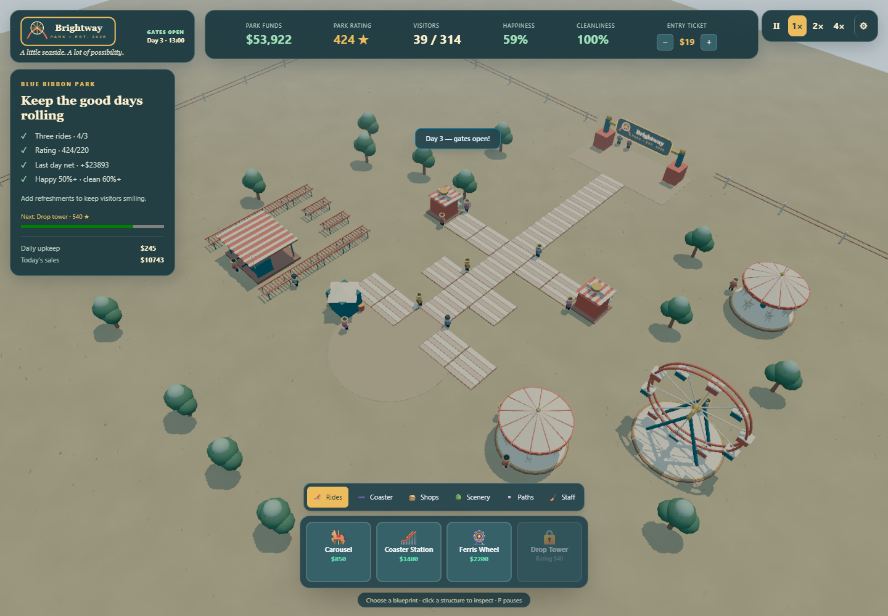
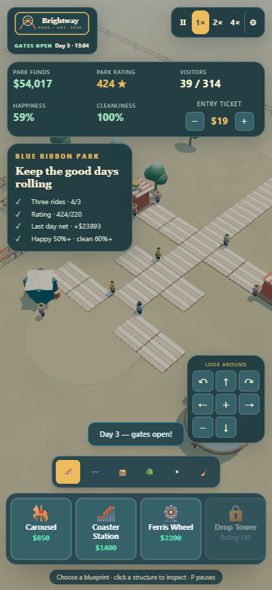
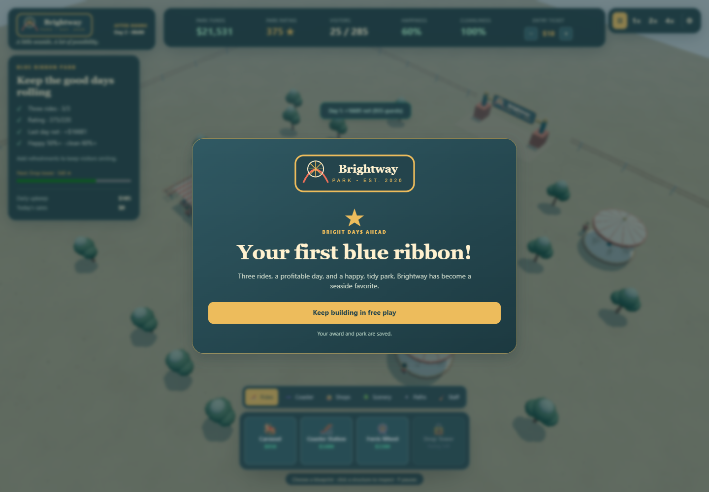

# Brightway Park — interacting operations beta

Verified 2026-10-03 against published packages, standalone Vite on port 5175.

## Current authored map and native controls

The baseline captures are `shots/brightway-baseline.png` and
`shots/brightway-baseline-paused.png`. The original path ended before the
entrance and left rides disconnected. The editor RPC authored ten path links
and two shade trees, preserving starter placements. The exact `export_document`
JSON was persisted without changing fields; the standalone `save_scene` HTTP
endpoint is absent. `.scratch/editor-author.log` records the RPCs and the saved
summary: 51 markers, one coaster route. Runtime assertions cover path access.

Actual native pointer/keyboard play opened the park, expanded the ride roster,
inspected the Carousel, paused with P, bought Premium and saved while paused.
`shots/brightway-planning-readable.png` shows the two upgrade choices and their
costs; `shots/brightway-premium-saved.png` shows the purchase consequence:
$6,000 → $5,617, capacity 6 → 9, appeal 4 → 5.8, upkeep $22 → $33, and service
6 → 6.9 seconds. The saved status reports $5,617. The pause strip leaves the
catalog and inspector usable. No debug funds or state grants were used.

The connected entrance, Carousel branch, Coaster queue, shade, roster, header,
upgrade choices and save feedback were visually inspected. The inspector fits
at 238 pixels wide on desktop. Header pause now uses visible Pause/Resume text.
Post-compaction portrait captures `shots/brightway-portrait-complete.png` and
`shots/brightway-portrait-purchase.png` show the complete Efficient/Premium
choices and Demolish control, then a native paid Premium upgrade and Save.
Operating figures collapse on compact viewports so choices remain accessible;
the camera pad stays beside the inspector. The compact landscape title keeps
its Open button visible. `shots/brightway-landscape-complete.png` shows both
complete upgrade descriptions at 844 × 390 CSS pixels;
`shots/brightway-landscape-purchase.png` shows a native Premium purchase and
Save, with upkeep $33/day, saved cash $5,617 and the $617 demolition refund.
These are post-compaction captures. Visually inspected portrait and landscape
views preserve the original model silhouettes and palette.

## Independent strategy verification

`src/game/strategy.playtest.test.ts` exercises ordinary commands and natural
simulation, without granting cash, rating, visitors, or wear. Five tests and
54 assertions pass:

- Local marketing, lean stock and efficient rides reach the day-two ribbon:
  cash $6,708; last revenue $3,951; upkeep $337; happiness 56.36%; litter zero.
- Festival marketing, buffered stock and premium rides also reach the ribbon:
  cash $7,595; revenue $5,558; upkeep $1,057; happiness 54.89%; litter zero.
- A $60 entry ticket with festival spending reaches bankruptcy. Naturally worn
  rides close, recover at lower upkeep, and reopen.
- Pause and complete save/reload retain policies and three premium refits.
- After the award, Continue permits a normally funded unlocked Ferris Wheel
  with an entrance-connected path. Heat and rain through day five retain
  positive cash, four rides and no bankruptcy with maintenance; the simulation
  advances at the same 0.25-second fidelity.

These are headless campaign results. Native captures prove the actual controls,
map and purchase/save feedback; they do not prove a full season in the browser.

## Runtime limits

The same-board native desktop snapshot after model compaction reports 61
objects, 24 guests, 300 draw calls and 132,064 triangles, compared with 1,867
draw calls and 132,160 triangles before compaction. Draw calls fell 84% and
now fit the 600-call cinematic budget. The pre-compaction cloud software
renderer reported 0.2 fps and about 4.1 seconds per frame, overwhelmingly
outside simulation; browser captures here do not establish hardware GPU
performance or a full browser season.

The game-owned model exporter merged compatible original meshes while retaining
vertex colors. All 23 models decreased from 487 to 33 primitives, preserving
22,872 triangles exactly, vertex palette histograms, bounds within 0.0001 units
and all ten named Ferris cabins. Two regeneration runs produced identical
SHA-256 hashes. No package or SDK changes were needed.

Final validation: 45 tests, 232 assertions across nine files, and typechecking
pass. The authoring and native logs remain under `.scratch/`. Parent HQ archives the
reviewed images and evidence centrally.

## Earlier baseline evidence (2026-09-29)

The following report is historical and does not verify the current operations
policies, wear or authored connectivity.

### Authored midway batch

Verified on 2026-09-29, port 4602, solo backend and an isolated browser profile.
The images below are captures of the running game. Desktop and mobile captures
use the production Vite build; the award capture uses the same game in dev mode.

## Observed controls and saves

- Opened a fresh park through the start button; the prior save was archived byte
  for byte. Built a janitor post and third carousel through catalog and canvas
  clicks, then ran at 4×. The blue ribbon appeared at midnight on day two, with
  a last-day net of $16,681. Reload retained the pending award; free play worked
  and its acknowledgement survived another reload.
- Selected, inspected and demolished a janitor post through world clicks. The
  $150 refund and upkeep decrease appeared in the HUD.
- P paused and resumed; 1 selected the carousel; X cancelled. Settings blocked
  gameplay shortcuts. Reduced motion and contrast checkboxes survived reload.
- At 390 × 844 and 320 × 568, document width matched viewport width. The small
  settings dialog scrolled to its close button. Holding the camera pad's arrow
  panned the actual camera; zoom changed its height. A mobile-layout catalog
  click placed a tree at (12, 32).
- The compiled game restored $53,547, 39 visitors and 53 placed objects after
  reload, with award and free-play state retained. Raising the ticket to $19
  survived reload. Fresh production navigation reported no failed HTTP requests
  or console errors. Windows WebGL emitted shader precision warnings during
  earlier dev sessions; the scene continued rendering.

## Reproduce checks

Run from `brightway-park/`: `bun run check-types`, `bun run test`, and
`bun run vite build`. Observed: 29 tests, 128 assertions, no failures. The build
warns about the existing large engine JavaScript chunk.

`bun run author-models` regenerates the original local meshes. See
[art credits](../ART-CREDITS.md) for retained third-party provenance.

Native diagnostics are optional: set `BRIGHTWAY_EVIDENCE_DIR` to the repository
home's task evidence directory and `VITE_PARK_EVIDENCE=1`, then run the dev script.
Commands, canvas coordinates, camera poses, keyboard events and runtime/network
failures append to `native-events.jsonl`. This endpoint is absent from builds.

## Remaining limits

Bankruptcy and closed-park command guards pass focused simulation tests with
forced debt; a three-day bankruptcy was not reached through native play. Coaster
track art currently uses straight segments and the train stays at its station.
The next useful batch is connected track turns, train travel and economy tuning.

The published shell retains the initial menu's empty action map. Brightway routes
its discrete keyboard actions locally, honoring the shell's persisted binding
overrides and stopping duplicate dispatch. Touch camera buttons use the existing
RTS rig's DOM input boundary; no published packages were patched.
